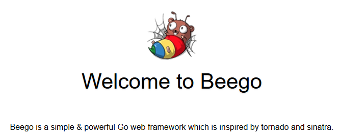

# Kournal (Karma Journal)
Some kind of journal for some kind of karma.

## Where to start
Setup go and GOPATH.

## Beego and Bee Tool
Get the libs. (Use 'go get -u' to update.)
```
go get github.com/astaxie/beego
go get github.com/beego/bee
```
> Add $GOPATH/bin to %PATH

Generate new empty project.
```
bee new kournal
```

## Run
```
go run main.go
```

Open your browser and visit http://localhost:8080

